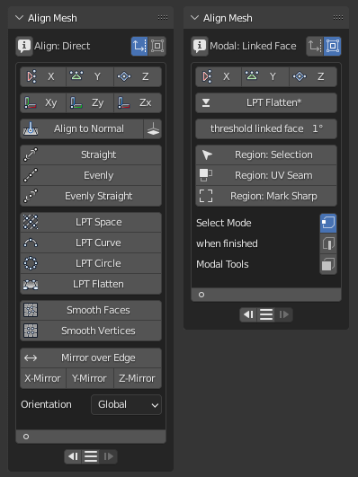

# Align Mesh - Blender addon

Align tools for vertices, edges and faces geometry in editmode:
- align selected in x-y-z or normal direction.
- align to selected to global axis.
- align selected to straight line.
- spread selected evenly.
- smooth faces and vertices.
- mirror over edge or in x-y-z direction.
- modal flatten of faces in combination with selected linked face. 
- modal uv seam or mark sharp creation of faces in combination with selected linked face. 
- included addon functions from Looptools.

Release download: https://github.com/mkbreuer/view3d_alignmesh/releases

Comes only with a panel interface! 
But it is a part of the SnapSet addon, that has different context menus and a pie menu layout!
https://github.com/mkbreuer/view3d_snapset

